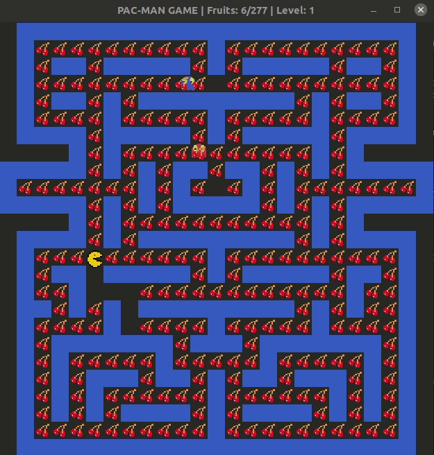
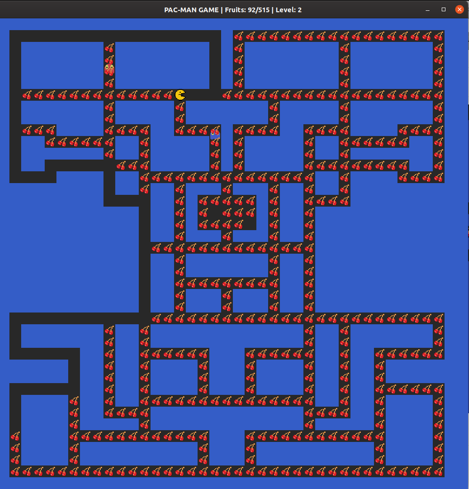
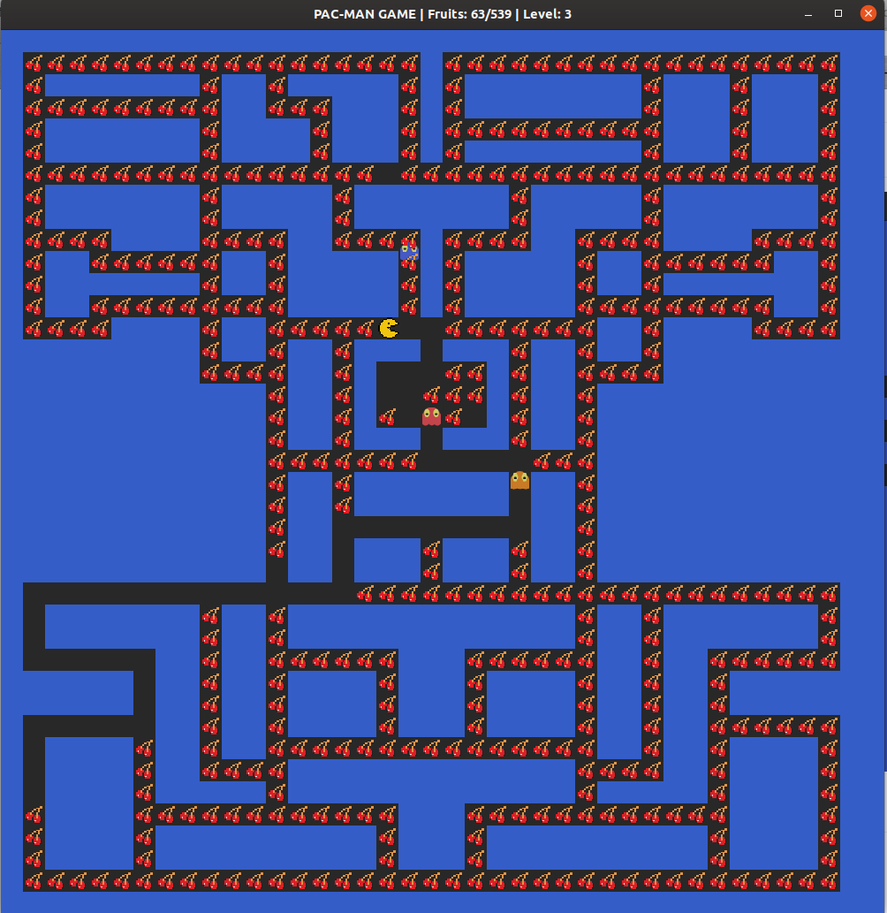

# PacMan Game with AI

## Demo:

## Used:
C++, SFML, Cmake

## Pre-install
You need SFML library, for Linux you can install it using this command:
`sudo apt-get install libsfml-dev`.

You can build the project from IDE, for example CLion or directly from console using `cmake`

## About
It's AI Pac-Man game, you also can click on cell and pacman will go to that cell directly using shortest path.
As for now there is only 3 levels, with various difficulty for pacman (number of ghosts, map and speed of ghosts).